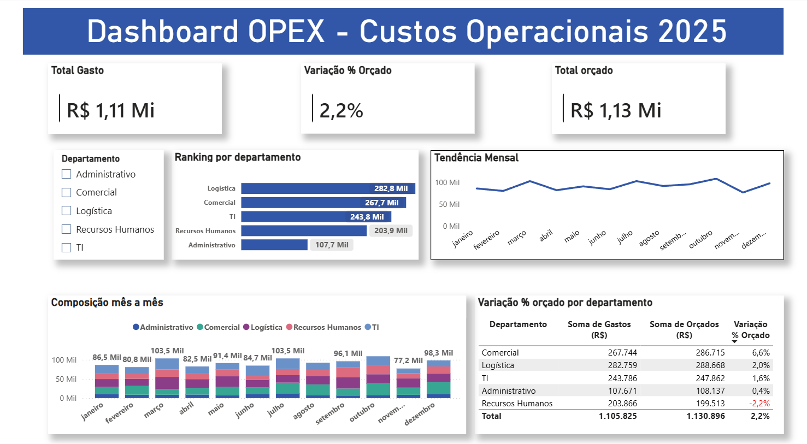

# Dashboard de Análise de Custos Operacionais (OPEX)



> **Aviso:** a base de dados usada neste projeto é fictícia, criada para fins de portfólio. Não representa dados reais de nenhuma empresa.

## A pergunta de negócio

Como os custos operacionais de uma empresa se comportam ao longo do tempo, e quais departamentos apresentam maior potencial de otimização?

## O achado principal

Dos 5 departamentos analisados, apenas **Recursos Humanos estourou o orçamento**: gastou R$ 203.865,64 contra R$ 199.512,69 planejados, uma variação de **-2,2%** (cerca de R$ 4.353 acima do previsto). Todos os outros quatro departamentos ficaram dentro ou abaixo do orçado — Comercial foi o mais econômico, com 6,6% de folga.

## O que o projeto cobre

**1. Modelagem do dataset**
Base transacional (não agregada) de lançamentos de despesa: 5 departamentos, 12 meses, com colunas de dimensão (departamento, centro de custo, categoria, fornecedor, data) e métrica (valor real, valor orçado).

**2. Limpeza de dados (Power Query)**
A base bruta veio com sujeiras propositais, tratadas no Power Query:
- Departamento grafado de até 4 formas diferentes (ex: "T.I.", "Tecnologia", "Tec. da Informação" → "TI")
- Categoria com inconsistência de maiúscula/minúscula e um erro de digitação
- Datas gravadas como texto, misturadas com datas reais
- Linhas duplicadas
- Valores de custo faltantes, sinalizados numa coluna `revisar_manualmente` em vez de preenchidos artificialmente

**3. Modelo e medidas (DAX)**
Medida de variação percentual entre valor real e orçado:
```dax
Variação % Orçado = DIVIDE(SUM(Orçado) - SUM(Valor), SUM(Orçado))
```

**4. Dashboard (Power BI)**
- Ranking de departamentos por custo total
- Tendência mensal de gastos
- Comparativo mês a mês por departamento (colunas empilhadas)
- Segmentação de dados (slicer) interativa por departamento
- Tabela de variação % orçado por departamento, com destaque visual no desvio

## Como reproduzir

1. Baixe o arquivo `dashboard/opex_dashboard.pbix`
2. Abra no [Power BI Desktop](https://powerbi.microsoft.com/desktop) (gratuito)
3. Os dados de origem estão em `data/`, tanto a versão bruta quanto a já tratada

## Estrutura do repositório

```
opex-dashboard-powerbi/
├── README.md
├── data/
│   ├── custos_operacionais_2025_bruto.xlsx
│   └── custos_operacionais_2025_limpo.xlsx
├── dashboard/
│   └── opex_dashboard.pbix
└── imagens/
    ├── dashboard_final.png
    └── planilha_antes_depois.png
```

## Ferramentas utilizadas

Excel · Power Query · Power BI · DAX
